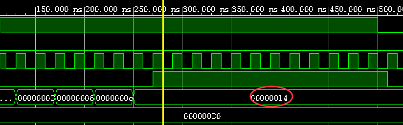

# Verilog Review

Course: Verilog

Last edited on: 20240523

Last edited by: Mikyxx

# Verilog考试info

* **题型**：第一题分别用数据流/模块化/行为描述实现一个模块，之后均为代码填空，后两题涉及到仿真文件的编写以及仿真波形图的绘制

* **唯一强调**：使用Verilog内置的门模块时，可能会有多个输入，此时一定将输出写在参数列表的**首位**！事实上，参数列表标准写法应该是先输出再输入，但实验代码相反，因为对于自己实现的模块参数顺序并不重要。例如**与门**调用代码如下：
  
  ```verilog
  and a1(out, 输入1, 输入2, 输入3,...);
  ```

# Verilog语法tips

* 数值常量格式：`<宽度>'<进制><数值>`，进制包括`d`(十进制，尽量只在仿真程序中使用)，`h`(十六进制，常用)，`b`(二进制，常用)，`o`(八进制，几乎不用)。

* `parameter`可实现调用模块时传入不同参数，定义如下：
  
  ```verilog
  module mux2_1#(parameter N = 2)(out, a, b, sel);    // 模块外参数定义
      parameter N = 2;    // 模块内参数定义，二选一使用即可
      output [N-1:0] out;
      ...
  ```
  
  顶层模块中调用如下：
  
  ```verilog
  mux2_1 #(4) dut0(out, x, y, s);    // 实例化后参数N值为4
  mux2_1 #(.N(4)) dut0(out, x, y, s;)// 名称关联
  ```
  
  注意**模块内**参数定义最好打头写，参数需先定义才能在后续数据定义中使用。

* `initial`语句与`always`语句用于行为建模，不能嵌套，块中语句的**左边变量必须是`reg`类型**，若块中有多条语句，需用`begin/end`组合。`initial`块均从0时刻开始并行独立执行，并只执行一次；`always`块从0时刻开始不断循环执行，只要`@()`中**事件成立**就执行块中所有语句。

* `always@()`有两种事件控制方式：**电平**敏感用于描述组合逻辑，列表内**有信号发生电平变化**就执行，信号间并列可用`or`或`,`，也可用`*`替换列表，此时编译器根据块内容自动识别列表；**边沿**触发用于描述时序逻辑，`always@(posedge clk)`表示`clk`从低到高变化时执行语句，即时钟上升沿，反之`negedge`表示从高到低。
  
  ```verilog
  // 三种写法等价
  always@(a or b) begin
      out = a + b;
  end
  
  always@(a, b) begin
      out = a + b;
  end
  
  always@(*) begin
      out = a + b;
  end
  ```

* 输出声明有`reg`与无`reg`区别在于：
  
  - `output`只能被赋值一次，且只能被连接到一个`wire`或`reg`；
  
  - `output reg`可以被多次赋值，且可以被连接到任何类型的`wire`或`reg`。如果需要在`always`块中对`output`进行赋值或修改，必须使用`output reg`。

* `wire`数据类型：`wire`表示单向数据线，其作用是**连接模块的输入和输出**。在模块中，`wire`被用作数据线，将输入端口连接到模块的输出端口，以实现信号传输；**在模块之间，`wire`可以用于连接两个模块的输出和输入**，只在`assign`语句的右边变量或模块间联系输出与输入的变量出现，`always`与`initial`块中的变量均不能是`wire`。

* **何时使用`wire`，何时使用`reg`？**
  
  * `assign`语句的左边变量必须定义为`wire`
    
    ```verilog
    reg a, b;
    wire ans;
    assign ans = a + b;
    ```
  
  * 连接子模块输入输出的中间变量必须定义为`wire`
  
  * `begin\end`之间的变量必须定义为`reg`

* 过程赋值分为两种：阻塞型过程赋值`=`，非阻塞型过程赋值`<=`。区别在于**阻塞赋值**在执行完之前，后面的语句不能执行，即**顺序执行**；而**非阻塞赋值**与后面的相关语句**并行执行**。`initial`与`always`块中一般使用`<=`，`assign`语句中一般使用`=`。

# 实验2

## 实验2_1 直接驱动7段数码管

### 内容：

* 用SW[7:0]直接驱动7段数码管的CA-CG、DP显示单元。

* 用SW[15:8]选择被驱动的7段数码管。

* 用LED[15:0]显示SW的状态。

### 代码：

```verilog
`timescale 1ns / 1ps

module _7Seg_Driver_Direct(SW, CA, CB, CC, CD, CE, CF, CG, DP, AN, LED);
    input  [15:0] SW;                              // 16位拨动开关
    output        CA, CB, CC, CD, CE, CF, CG, DP;  // 7段数码管驱动，低电平有效
    output [7:0]  AN;                              // 7段数码管片选信号，低电平有效
    output [15:0] LED;                             // 16位LED显示，高电平有效

    assign {CA, CB, CC, CD, CE, CF, CG, DP} = ~SW[7:0];
    assign AN[7:0] = ~SW[15:8];
    assign LED[15:0] = SW[15:0];
endmodule
```

* **timescale**:\``timescale`为编译指令，影响后续所有编译的模块的时延值，直至遇到下一个timescale，因此每个模块文件必须以timescale打头，否则在板上运行时可能有误。

* **连续赋值**：用`assign`标识，始终处于激活状态，一旦右边变量发生变化，表达式立即进行计算并将结果赋给左边变量。

* **向量拼接**：使用`{}`连接运算符，将向量or标量拼接成更大的向量，整体赋值而无需遍历小向量or标量。

* **高低电平转换**：使用`~`逐位取非运算符，对一个高电平有效的向量逐位取非即可得到低电平有效。

## 实验2_2 译码驱动7段数码管

### 内容：

- 用SW[3:0]输入待显示的单个数字。（四位二进制，范围0~15）

- 用SW[15:8]选择被驱动的7段数码管。

- 用LED[15:0]显示SW的状态。

### 代码：

```verilog
`timescale 1ns / 1ps

module _7Seg_Driver_Decode(SW, SEG, AN, LED);
    input      [15:0] SW;      // 16位拨动开关
    output reg [7:0]  SEG;     // 7段数码管驱动，低电平有效
    output     [7:0]  AN;      // 7段数码管片选信号，低电平有效
    output     [15:0] LED;     // 16位LED显示

    always@(SW) begin
        case (SW[3:0])
            4'b0000 : SEG = 8'b11000000;    // 0
            4'b0001 : SEG = 8'b11111001;    // 1
            4'b0010 : SEG = 8'b10100100;    // 2
            4'b0011 : SEG = 8'b10110000;    // 3

            4'b0100 : SEG = 8'b10011001;    // 4
            4'b0101 : SEG = 8'b10010010;    // 5
            4'b0110 : SEG = 8'b10000010;    // 6
            4'b0111 : SEG = 8'b11111000;    // 7

            4'b1000 : SEG = 8'b10000000;    // 8
            4'b1001 : SEG = 8'b10011000;    // 9
            4'b1010 : SEG = 8'b10001000;    // A
            4'b1011 : SEG = 8'b10000011;    // b

            4'b1100 : SEG = 8'b11000110;    // C
            4'b1101 : SEG = 8'b10100001;    // d
            4'b1110 : SEG = 8'b10000110;    // E
            4'b1111 : SEG = 8'b10001110;    // F
        endcase
    end

    assign AN[7:0] = ~SW[15:8];
    assign LED[15:0] = SW[15:0];
endmodule
```

* **显示码**：八位二进制数，从最高位开始依次对应7段管中的**小数点，中二，左一，左二，中三，右二，右一，中一**，低电平有效，即要亮的赋0。
* 注意：此时`SEG`在`always`块中被赋值，因此需声明为`reg`。

## 实验2_3 译码选择7段数码管

### 内容：

* 连接“译码显示模块”与“译码选择模块”，实现“静态7段数码管显示”模块。

* 用SW[3:0]输入待显示的单个二进制数字（0-15）。

* 用SW[15:13]输入点亮的数码管二进制编号（0-7号）。

* 用LED[15:0]显示SW的状态。

### 代码：

```verilog
// 译码显示模块
`timescale 1ns / 1ps

module _7Seg_Driver_Decode(SW, SEG);
    input      [3:0] SW;       // 16位拨动开关
    output reg [7:0] SEG;      // 7段数码管驱动，低电平有效

    always@(SW) begin
       case (SW)
           4'b0000 : SEG = 8'b11000000;    // 0
           4'b0001 : SEG = 8'b11111001;    // 1
           4'b0010 : SEG = 8'b10100100;    // 2
           4'b0011 : SEG = 8'b10110000;    // 3

           4'b0100 : SEG = 8'b10011001;    // 4
           4'b0101 : SEG = 8'b10010010;    // 5
           4'b0110 : SEG = 8'b10000010;    // 6
           4'b0111 : SEG = 8'b11111000;    // 7

           4'b1000 : SEG = 8'b10000000;    // 8
           4'b1001 : SEG = 8'b10011000;    // 9
           4'b1010 : SEG = 8'b10001000;    // A
           4'b1011 : SEG = 8'b10000011;    // b

           4'b1100 : SEG = 8'b11000110;    // C
           4'b1101 : SEG = 8'b10100001;    // d
           4'b1110 : SEG = 8'b10000110;    // E
           4'b1111 : SEG = 8'b10001110;    // F
       endcase
    end
endmodule
```

```verilog
// 译码选择模块
`timescale 1ns / 1ps

module _7Seg_Driver_Select(SW, AN);
    input      [2:0] SW;       // 16位拨动开关
    output reg [7:0] AN;       // 7段数码管片选信号，低电平有效

    always@(SW) begin
       case (SW)
           3'b000 : AN = 8'b11111110;    // 0
           3'b001 : AN = 8'b11111101;    // 1
           3'b010 : AN = 8'b11111011;    // 2
           3'b011 : AN = 8'b11110111;    // 3

           3'b100 : AN = 8'b11101111;    // 4
           3'b101 : AN = 8'b11011111;    // 5
           3'b110 : AN = 8'b10111111;    // 6
           3'b111 : AN = 8'b01111111;    // 7
       endcase
    end
endmodule
```

```verilog
// 顶层模块，连接两个子模块
`timescale 1ns / 1ps

module _7Seg_Driver_Choice(SW, SEG, AN, LED);
    input  [15:0] SW;       // 16位拨动开关
    output [7:0]  SEG;      // 7段数码管驱动，低电平有效
    output [7:0]  AN;       // 7段数码管片选信号，低电平有效
    output [15:0] LED;      // 16位LED显示

    _7Seg_Driver_Decode d(
        .SW(SW[3:0]),
        .SEG(SEG)
    );

    _7Seg_Driver_Select s(
        .SW(SW[15:13]),
        .AN(AN)
    );

    assign LED[15:0] = SW[15:0];
endmodule
```

* **结构描述与模块调用**：结构描述即将子模块与主模块分开实现。将其分别写在一个.v文件中，文件名为模块名，且.v文件放在一个项目内。调用子模块格式为：
  
  ```verilog
  模块名 [#(.参数1)(参数1值),...] [实例名](
      .形参1(实参1),
      .形参2(实参2),
      ......
  );
  ```
  
  实例名可任意取名，也可省略，若省略则默认为实例名。在Vivado中还需将主模块.v文件**Set as Top**以标记其为主模块，右键点击.v文件即可看到Set as Top。

## 实验2_4 二进制-BCD码转换器（选做）

### 内容：

* 即在实验2_3的基础上将10-15以十进制显示而非十六进制的A-E。
- 用SW[3:0]输入待转换为BCD码的单个二进制数字（0-15）。

- 用SW[14:12]输入点亮的数码管二进制编号（0-7号）。

- 用SW[15]选择显示BCD码的十位或个位（0为个位，1为十位）。

- 用LED[15:0]显示SW的状态。

### 代码：

```verilog
// 译码显示模块
`timescale 1ns / 1ps

module _7Seg_Driver_Decode(SW, CHOICE, SEG);
    input      [3:0] SW;       // 16位拨动开关
    input            CHOICE;
    output reg [7:0] SEG;      // 7段数码管驱动，低电平有效

    integer ans, i, multi;
    reg [3:0] t;

    always@(SW) begin
        // 将二进制数转换为十进制数
        for(i = 0, multi = 1, ans = 0; i < 4; i = i + 1) begin
            ans = ans + multi * SW[i];
            multi = multi * 2;
        end

        if(CHOICE)  // 取十位
            ans = ans / 10;
        else        // 取个位
            ans = ans % 10;

        case (ans)
            0 : SEG = 8'b11000000;    // 0
            1 : SEG = 8'b11111001;    // 1
            2 : SEG = 8'b10100100;    // 2
            3 : SEG = 8'b10110000;    // 3

            4 : SEG = 8'b10011001;    // 4
            5 : SEG = 8'b10010010;    // 5
            6 : SEG = 8'b10000010;    // 6
            7 : SEG = 8'b11111000;    // 7

            8 : SEG = 8'b10000000;    // 8
            9 : SEG = 8'b10011000;    // 9
        endcase
    end
endmodule
```

```verilog
// 译码选择模块
`timescale 1ns / 1ps

module _7Seg_Driver_Select(SW, AN);
    input      [2:0] SW;       // 16位拨动开关
    output reg [7:0] AN;       // 7段数码管片选信号，低电平有效

    always@(SW) begin
       case (SW)
           3'b000 : AN = 8'b11111110;    // 0
           3'b001 : AN = 8'b11111101;    // 1
           3'b010 : AN = 8'b11111011;    // 2
           3'b011 : AN = 8'b11110111;    // 3

           3'b100 : AN = 8'b11101111;    // 4
           3'b101 : AN = 8'b11011111;    // 5
           3'b110 : AN = 8'b10111111;    // 6
           3'b111 : AN = 8'b01111111;    // 7
       endcase
    end
endmodule
```

```verilog
// _BCD_Driver.v 连接上述两个模块
`timescale 1ns / 1ps

module _BCD_Driver(SW, SEG, AN, LED);
    input  [15:0] SW;       // 16位拨动开关
    output [7:0]  SEG;      // 7段数码管驱动，低电平有效
    output [7:0]  AN;       // 7段数码管片选信号，低电平有效
    output [15:0] LED;      // 16位LED显示

    _7Seg_Driver_Decode fun1(
        .SW(SW[3:0]),
        .CHOICE(SW[15]),
        .SEG(SEG)
    );

    _7Seg_Driver_Select fun2(
        .SW(SW[14:12]),
        .AN(AN)
    );

    assign LED[15:0] = SW[15:0];
endmodule
```

* 本选做实验难点在于用Verilog实现二进制数向十进制数的转换与数位的选择，语法与C语言类似。

# 实验3

## 实验3_1 设计时钟分频器控制LED灯闪亮

### 内容：

* 实验板的系统时钟信号由E3引脚提供，频率100MHz，周期10ns。**分频**即将时钟信号的频率进行降低，N分频指将频率降低为原来的1/N，一般将N定义为参数，便于上层模块改变分频系数。

* 设计一个频率为1Hz、周期为1s的分频器divider。**可在模块中定义参数delay，值为50,000,000，定义变量cnt对系统时钟clk的上升沿进行计数，每当cnt=delay（50,000,000 * 10ns = 0.5s）时，反转分频时钟信号CK的电平，即可得到周期为1s的分频时钟信号。**

* 注意一个时钟周期中高电平与低电平各一半，周期1s意味着每隔0.5s电平需要反转一次，因此我们以0.5s为一次计数终点。

* 设计上层模块lab3_1，实例化divider，用其输出信号控制LED[0]闪亮，即一秒闪一次；可以修改divider中参数delay，观察闪亮速度的变化。

### 代码：

```verilog
`timescale 1ns / 1ps

module divider(clk, clk_N);
    parameter  N = 100_000_000; // 1Hz的时钟,N=fclk/fclk_N
    input      clk;             // 系统时钟
    output reg clk_N;           // 分频后的时钟

    reg [31:0] counter;         /* 计数器变量，通过计数实现分频。
                                   当计数器从0计数到(N/2-1)时，
                                   输出时钟反转，计数器清零 */
    always@(posedge clk) begin    // 时钟上升沿
        counter <= counter + 1;                      
        if(counter >= N / 2 - 1) begin
            clk_N <= ~clk_N;    // 输出时钟反转
            counter <= 0;       // 计数器清零
        end
    end                           
endmodule
```

## 实验3_2 设计3位计数器

### 内容：

* 计数器即在时钟信号沿的控制下自动加或减的时序电路。

* 本实验仅要求实现自动加1的3位二进制计数器，逢8送0。

### 代码：

```verilog
`timescale 1ns / 1ps

module counter(clk, out);
    input            clk;             // 计数时钟
    output reg [2:0] out;             // 计数值

    always@(posedge clk) begin  // 在时钟上升沿计数器加1
        if (out >= 7)
            out <= 0;
        else 
            out <= out + 1;
    end                           
endmodule
```

## 实验3_3 计数器控制LED灯闪亮

### 内容：

* 设计一个包含分频器与计数器的上层模块，使用分频时钟控制计数，并用输出的计数值控制3个LED灯闪亮。

### 代码：

```verilog
`timescale 1ns / 1ps

module divideCounter(clk, out);
    input        clk;
    output [2:0] out;

    wire         clk_N;

    divider d(
        .clk(clk), 
        .clk_N(clk_N)
    );
    counter c(
        .clk(clk_N), 
        .out(out)
    );
endmodule
```

* **`wire`用例**：如本实验代码所示，`clk_N`是`divider`的输出与`counter`的输入，作为子模块间传输用的中间数据，被定义为`wire`。

* **调用已有模块**：在加入子模块源文件时，选择添加已有文件（Add Files），并**务必勾选"Copy sources into project"**，将备份加入本项目以便修改。

## 实验3_4 设计只读存储器（ROM）

### 内容：

* 设计一个容量为8单元的4位只读存储器，存放待显示数字0、2、4、6、8、A、C、E的4位二进制编码。可在`initial`语句中对存储器进行初始化。

### 代码：

```verilog
`timescale 1ns / 1ps

module rom8x4(addr, data);
    input  [2:0] addr;          // 地址
    output [3:0] data;          // 地址addr处存储的数据 

    reg    [3:0] mem[7:0];      //  8个4位的存储器

    initial begin               // 初始化存储器
            mem[0]=4'b0000;
            mem[1]=4'b0010;
            mem[2]=4'b0100;
            mem[3]=4'b0110;
            mem[4]=4'b1000;
            mem[5]=4'b1010;
            mem[6]=4'b1100;
            mem[7]=4'b1110;
    end

    assign data[3:0] = mem[addr];// 读取addr单元的值输出                  
endmodule
```

* **数组定义**：`reg [n:0] mem[m:0]`表示m个n位存储器。

## 实验3_5 设计3_8解码器与7段显示译码器

* 实验2中已设计，可直接复用。

### 代码：

```verilog
`timescale 1ns / 1ps

module decoder3_8(num, sel);
    input      [2:0] num;       // 数码管编号：0~7
    output reg [7:0] sel;       // 7段数码管片选信号，低电平有效

    always@(num) begin
        case(num)  
            3'b000 : sel[7:0] = 8'b11111110;
            3'b001 : sel[7:0] = 8'b11111101;
            3'b010 : sel[7:0] = 8'b11111011;
            3'b011 : sel[7:0] = 8'b11110111;
            3'b100 : sel[7:0] = 8'b11101111;
            3'b101 : sel[7:0] = 8'b11011111;
            3'b110 : sel[7:0] = 8'b10111111;
            3'b111 : sel[7:0] = 8'b01111111;
        endcase
    end
endmodule
```

```verilog
`timescale 1ns / 1ps

module pattern(code, patt);
    input      [3:0] code;       // 16进制数字的4位二进制编码
    output reg [7:0] patt;       // 7段数码管驱动，低电平有效

    always@(code) begin
        case(code[3:0])
            4'b0000 : patt = 8'b11000000;
            4'b0001 : patt = 8'b11111001;
            4'b0010 : patt = 8'b10100100;
            4'b0011 : patt = 8'b10110000;
            4'b0100: patt = 8'b10011001;
            4'b0101: patt = 8'b10010010;
            4'b0110: patt = 8'b10000010;
            4'b0111: patt = 8'b11111000;
            4'b1000: patt = 8'b10000000;
            4'b1001: patt = 8'b10011000;
            4'b1010: patt = 8'b10001000;
            4'b1011: patt = 8'b10000011;
            4'b1100: patt = 8'b11000110;
            4'b1101: patt = 8'b10100001;
            4'b1110: patt = 8'b10000110;
            4'b1111: patt = 8'b10001110;
        endcase
    end
endmodule
```

## 实验3_6 实现数码管动态显示

### 内容：

* 设计数码管动态显示的顶层模块，八个数码管从右至左依次显示存储器中的数据，每秒亮一个。

### 代码：

```verilog
`timescale 1ns / 1ps

module dynamic_scan(clk, SEG, AN);
    input        clk;       // 系统时钟
    output [7:0] SEG;       // 分别对应CA、CB、CC、CD、CE、CF、CG和DP
    output [7:0] AN;        // 8位数码管片选信号
    wire         clk_tmp;
    wire   [2:0] num;
    wire   [3:0] code;

    // 分频器将系统时钟转换为分频时钟
    divider d1(
        .clk(clk), 
        .clk_N(clk_tmp)
    );
    // 计数器根据分频时钟进行计数
    counter c1(
        .clk(clk_tmp), 
        .out(num[2:0])
    );
    // 将计数结果转换为数码管序号，即亮第几个数码管
    decoder3_8 d2(
        .num(num[2:0]), 
        .sel(AN[7:0])
    );
    // 用计数结果在ROM中寻址，返回将显示的数字
    rom8x4 r1(
        .addr(num[2:0]), 
        .data(code[3:0])
    );
    pattern p1(
        .code(code[3:0]), 
        .patt(SEG[7:0])
    );
endmodule
```

## 实验3_7 实现“跑马灯”（选做）

### 内容：

* 增加三个开关，左中右；左右两个开关控制跑马灯的方向，即实验3_6中数码管亮起的方向；中间开关停止跑动，八个数码管“同时”显示只读存储器中的数据。

* **实现思路**：数码管序号与显示的数字已绑定，即哪个数码管显示哪个数已确定，只与计数结果有关，因此解码器、ROM、译码器均无需修改，只需修改分频器与计数器。**控制方向**可通过计数器的**自动加/减1**实现，显然计数器自动加1时数字向左移动，自动减1时向右移动，此外还需考虑非法输入，除了拨动左边或右边开关外的情况下，计数器停止计数，此时数字不移动。**停止跑动**可通过**提高分频时钟频率**实现，我们将分频时钟周期定为1s时可以观察到数码管以1s的间隔分别亮起，可以想象，如果我们将周期降低，数码管在很短的一段时间内逐个亮起，形如闪烁，只要周期足够小，使人眼感受不到闪烁，即可在视觉上“同时”显示不同数字。经实验，此处N选用1000。

### 代码：

```verilog
`timescale 1ns / 1ps

module divider(clk, clk_N, SW);
    input       clk;
    input [2:0] SW;         
    output  reg clk_N;               
    integer     N = 100_000_000;
    reg  [31:0] counter;

    always@(posedge clk) begin 
        case(SW) 
            3'b010: N = 1_000;
            default: N = 100_000_000;
        endcase

        counter <= counter + 1;                      
        if(counter >= N / 2 - 1) begin
            clk_N <= ~clk_N;    // 输出时钟反转
            counter <= 0;       // 计数器清零
        end
    end                           
endmodule
```

```verilog
`timescale 1ns / 1ps

module counter(clk, out, SW);
    input            clk;
    input      [2:0] SW;
    output reg [2:0] out;

    always@(posedge clk) begin
        case(SW)
            3'b100 : out <= out + 1;
            3'b001 : out <= out - 1;
            default : out <= out;
        endcase
    end
endmodule
```

```verilog
`timescale 1ns / 1ps

module dynamic_scan(clk, SEG, AN, SW);
    input        clk;
    input  [2:0] SW;
    output [7:0] SEG;          
    output [7:0] AN;
    wire         clk_n;
    wire   [2:0] count;
    wire   [7:0] code;

    divider d1(
        .clk(clk), 
        .clk_N(clk_n),
        .SW(SW)
    );
    counter c1(
        .clk(clk_n),
        .out(count[2:0]), 
        .SW(SW)
    );
    decoder3_8 d2(
        .num(count[2:0]), 
        .sel(AN[7:0])
    );
    rom8x4 r1(
        .addr(count[2:0]), 
        .data(code[3:0])
    );
    pattern p1(
        .code(code[3:0]), 
        .patt(SEG[7:0])
    );
endmodule
```

# 实验4

## 数据通路设计

* ### n位全加器模块
  
  ```verilog
  `timescale 1ns / 1ps
  
  module full_adder(A, B, ans);
      parameter DATA_WIDTH = 8;
      input      [DATA_WIDTH-1:0] A;
      input      [DATA_WIDTH-1:0] B;
      output reg [DATA_WIDTH-1:0] ans;
  
      initial begin
          ans = 0;
      end
  
      always@(A, B) begin
          ans <= A + B;
      end
  endmodule
  ```
  
  * 实验要求各器件的**数据线宽度**初始设计为8位，但构成数据通路时可以**扩充**至16位或32位。因此将宽度定义为参数，用`parameter`传参进行扩展。

* ### n位2选1多路选择器模块
  
  ```verilog
  `timescale 1ns / 1ps
  
  module mux2_1(a, b, sel, out);
      parameter DATA_WIDTH = 8;
      input      [DATA_WIDTH-1:0] a;
      input      [DATA_WIDTH-1:0] b;
      input                       sel; 
      output reg [DATA_WIDTH-1:0] out;
  
      initial begin
          out = 0;
      end
  
      always@(sel, a, b) begin
          if (sel == 1) 
              out <= a;
          else 
              out <= b;
      end
  endmodule
  ```

* ### n位比较器模块
  
  ```verilog
  `timescale 1ns / 1ps
  
  module compare(A, B, G, E, L);
      parameter DATA_WIDTH = 8;
      input [DATA_WIDTH-1:0] A;
      input [DATA_WIDTH-1:0] B;
      output reg G;   // A大于B时G=1
      output reg E;   // A等于B时E=1
      output reg L;   // A小于B时L=1
  
      initial begin
          G=0;
          E=0;
          L=0;
      end
  
      always@(A, B) begin
          if (A > B) begin
              G=1;
              E=0;
              L=0;
          end
          else if (A == B) begin
              G=0;
              E=1;
              L=0;
          end
          else begin
              G=0;
              E=0;
              L=1;
          end
      end
  endmodule
  ```

* ### n位寄存器模块
  
  寄存器需含同步复位rst端与加载数据load端。当rst=1时，寄存器赋0；当load=1时，使输入D进入寄存器，并将寄存器值同步赋给输出Q，这要求**使用assign语句**，使输出Q总能与寄存器中内容相等。
  
  ```verilog
  `timescale 1ns / 1ps
  
  module register(D, Q, clk, load, rst);
      parameter DATA_WIDTH = 8;
      input  [DATA_WIDTH-1:0] D;
      output [DATA_WIDTH-1:0] Q;
      input clk;
      input load;
      input rst;
  
      reg [DATA_WIDTH-1:0] temp;
  
      initial begin
          temp = 0;
      end
  
      always@(posedge clk) begin
          // rst=1时同步复位
          if (rst == 1) begin
              temp <= 0;
          end
          else begin
              // load=1时D送入寄存器
              if (load)
                  temp <= D;
              else
                  temp <= temp;
          end
      end
  
      assign Q = temp;
  endmodule
  ```

* ### n位存储器模块
  
  存储器基本思想与实验3_4中ROM类似，但需存放一条数据链表，且第一个结点在0号地址。链表初始化使用系统函数$readmemh完成。
  
  ```verilog
  `timescale 1ns / 1ps
  
  module memory(addr, data);
      parameter DATA_WIDTH = 8;
      parameter ADDR_LENGTH = 16;
      input [DATA_WIDTH-1:0] addr;
      output reg [DATA_WIDTH-1:0] data;
  
      reg [DATA_WIDTH-1:0] list[ADDR_LENGTH-1:0];
  
      initial begin
          data = 0;
          $readmemh("ram_init.txt的绝对地址", list, 0, ADDR_LENGTH - 1);
      end
  
      always@(addr) begin
          data <= list[addr];
      end
  endmodule
  ```
  
  * `$readmemh("<数据文件名>", <存储器名>[, <起始地址>, <终止地址>]);`
  * **注意**：绝对地址一定要改为本地地址。

* ### 顶层模块
  
  原理图如下。
  
  
  
  观察到输入端口包括时钟clk、复位rst、加载LD_SUM、LD_NEXT、A_SEL、SUM_SEL、NEXT_SEL，输出端口包括链尾标志NEXT_ZERO、求和结果ans。根据原理图，定义wire变量连接子模块即可。
  
  ```verilog
  `timescale 1ns / 1ps
  
  module data_path(clk, rst, SUM_SEL, NEXT_SEL, A_SEL, LD_SUM, LD_NEXT, NEXT_ZERO, ans);
      parameter DATA_WIDTH = 8;
      input clk;    // 时钟
      input rst;    // 复位
      input SUM_SEL;   // 
      input NEXT_SEL;  // 存储器送新结点内容进NEXT寄存器与比较器
      input A_SEL;     // 地址计算器送新地址进存储器
      input LD_SUM;    // SUM寄存器读数据
      input LD_NEXT;   // NEXT寄存器读数据
      output NEXT_ZERO;// 链尾标志
      output ans;      // 求和结果
  
      wire [DATA_WIDTH-1:0] ans;
      wire [DATA_WIDTH-1:0] data;
      wire [DATA_WIDTH-1:0] step_ans;
      wire [DATA_WIDTH-1:0] save_ans;
      wire [DATA_WIDTH-1:0] addr;
      wire [DATA_WIDTH-1:0] next_addr;
      wire [DATA_WIDTH-1:0] cur_data_addr;
      wire [DATA_WIDTH-1:0] sel_addr;
  
      // 左上全加器
      full_adder  #(DATA_WIDTH) f1 (
          .A(ans),
          .B(data),
          .ans(step_ans)
      );
      // 左选择器
      mux2_1      #(DATA_WIDTH) m1 (
          .a(step_ans),
          .b(0),
          .sel(SUM_SEL),
          .out(save_ans)
      );
      // SUM寄存器
      register    #(DATA_WIDTH) r1 (
          .D(save_ans),
          .Q(ans),
          .clk(clk),
          .load(LD_SUM),
          .rst(rst)
      );
      // 中选择器
      mux2_1      #(DATA_WIDTH) m2 (
          .a(data),
          .b(0),
          .sel(NEXT_SEL),
          .out(next_addr)
      );
      // NEXT寄存器
      register    #(DATA_WIDTH) r2 (
          .D(next_addr),
          .Q(addr),
          .clk(clk),
          .load(LD_NEXT),
          .rst(rst)
      );
      // 中全加器
      full_adder  #(DATA_WIDTH) f2 (
          .A(1),
          .B(addr),
          .ans(cur_data_addr)
      );
      // 右选择器
      mux2_1      #(DATA_WIDTH) m3 (
          .a(cur_data_addr),
          .b(addr),
          .sel(A_SEL),
          .out(sel_addr)
      );
  
      memory      #(DATA_WIDTH) mem (
          .addr(sel_addr),
          .data(data)
      );
      compare     #(DATA_WIDTH) c (
          .A(next_addr),
          .B(0),
          .E(NEXT_ZERO),
      );
  endmodule
  ```

## 有限状态机（FSM）设计

FSM状态转移图如下。


```verilog
`timescale 1ns / 1ps

module FSM(clk, rst, start, NEXT_ZERO, LD_SUM, LD_NEXT, SUM_SEL, NEXT_SEL, A_SEL, done);
    input      clk;
    input      rst;
    input      start;
    input      NEXT_ZERO;
    output reg LD_SUM;
    output reg LD_NEXT;
    output reg SUM_SEL;
    output reg NEXT_SEL;
    output reg A_SEL;
    output reg done;

    reg [2:0] State;
    reg [2:0] StateNext;

    initial begin
        LD_SUM=0;
        LD_NEXT=0;
        SUM_SEL=0;
        NEXT_SEL=0;
        A_SEL=0;
        done=0;
        State = 0;
    end

    // 状态转移
    always@(*) begin
        case(State)
            // start
            0 : begin
                {LD_SUM,LD_NEXT,SUM_SEL,NEXT_SEL,A_SEL,done}=6'b000000;
                // 接收启动信号开始求和
                if (start==1) 
                    StateNext<=1;
                else
                    StateNext<=0;
            end
            // compute_sum 求和
            1 : begin
                {LD_SUM,LD_NEXT,SUM_SEL,NEXT_SEL,A_SEL,done}=6'b101110;
                // 求和完成后访问下一结点
                StateNext <= 2;
            end
            // get_next 访问下一结点
            2 : begin
                {LD_SUM,LD_NEXT,SUM_SEL,NEXT_SEL,A_SEL,done}=6'b011100;
                // 若到达链尾，进入结束状态
                if (NEXT_ZERO)
                    StateNext <= 3;
                // 否则继续求和
                 else
                    StateNext <= 1;
            end
            // done
            3 : begin
                {LD_SUM,LD_NEXT,SUM_SEL,NEXT_SEL,A_SEL,done}=6'b000001;
                if (start==1)
                    StateNext <= 3;
                else 
                    StateNext <= 0;
            end
        endcase
    end

    // 状态寄存器
    always@(posedge clk) begin
        if (rst == 1)
            State <= 0 ;
        else 
            State <= StateNext; 
    end
endmodule
```

## 自动运算电路设计

原理图如下。


```verilog
`timescale 1ns / 1ps

module Auto_Cal(start, rst, clk, done, sum_out);
    parameter DATA_WIDTH = 8;
    input start;    // 启动信号
    input rst;      // 复位信号
    input clk;      // 时钟信号
    output wire done;
    output wire [DATA_WIDTH-1:0] sum_out;

    wire NEXT_ZERO, LD_SUM, LD_NEXT, SUM_SEL, NEXT_SEL, A_SEL;

    FSM control (clk, rst, start, NEXT_ZERO, LD_SUM, LD_NEXT, SUM_SEL, NEXT_SEL, A_SEL, done);
    data_path #(DATA_WIDTH) dp (clk, rst, SUM_SEL, NEXT_SEL, A_SEL, LD_SUM, LD_NEXT, NEXT_ZERO, sum_out);
endmodule
```

## 仿真文件设计

```verilog
`timescale 1ns / 1ps

module Auto_Cal_tb();
    parameter DATA_WIDTH = 32;
    reg start;
    reg rst;
    reg clk;
    wire done;
    wire [DATA_WIDTH-1:0] sum_out;

    initial begin
        start = 0;
        rst = 0;
        clk = 0;
    end

    // 产生时钟信号
    always begin
        #10 clk = ~clk;
    end

    always begin
        // 100ns后按下启动键
        #100 start = 1;
        // 400ns后松开启动键
        #400 start = 0;
    end
    Auto_Cal #(DATA_WIDTH) tb (start,rst,clk,done,sum_out);
endmodule
```

* **注意**：仿真文件一定要作为"**simulation sources**"添加进项目。

* 仿真文件编写完成后已可以进行基本功能的验收，首先进行**综合**（Run Synthesis），再进行**仿真**，选择**Behavioral Simulation或Post-Synthesis Timing Simulation**得到的波形图相同，应如下图所示，重点为**14**，即16进制下的求和结果20。**考试可能有画波形图题，可能为本图**。注意，1bit数据才有传统意义上的波形图，可以看出高低电平，而多位的数据在图中只显示为16进制下的值，其值变化形如下图。
  
  

## 带数码管显示的自动运算电路（选做）

```verilog
`timescale 1ns / 1ps

module Auto_Cal_Final(clk, start, rst, done, SEG, AN);
    parameter DATA_WIDTH = 32;
    input            clk;
    input            start;
    input            rst;
    output           done;
    output     [7:0] SEG;
    output reg [7:0] AN;

    reg [3:0] seg;
    reg       count;

    wire                  clk_N;
    wire                  clk_P;
    wire [DATA_WIDTH-1:0] sum_out;

    divider d (clk,clk_N);
    divider #(1000000) dd (clk,clk_P);
    Auto_Cal #(DATA_WIDTH) AC (start,rst,clk_N,done,sum_out);
    pattern(seg, SEG);

    initial begin
        seg = 0;
        count = 0;
    end

    always@(posedge clk_P)
    begin
        if (count % 2 == 0) begin
            AN <= 8'b11111110;
            seg <= sum_out % 10;
            count <= count + 1;
        end
        else begin
            AN <= 8'b11111101;
            seg <= sum_out / 10;
            count <= count + 1;
        end
    end
endmodule
```

* **`clk_P`出现原因：** 本实验需要实现在视觉上“同时”改变两个数码管，如示数从“08”突变为“12”。但同一时钟信号内，我们只能向译码器`pattern`传递一个数字`seg`并显示在某个数码管上，通过已有`pattern`无法实现同时改变两个数码管的显示，只能交替改变某个数码管示数，因此为了实现视觉上的“同时改变”，我们考虑实验3_7的思路，提高时钟周期，使数码管示数的改变在短时间内大量发生，`clk_P`由此产生。对于交替改变数码管的实现，我们判断`clk_P`计数结果的奇偶性，分别改变十位与个位的示数。